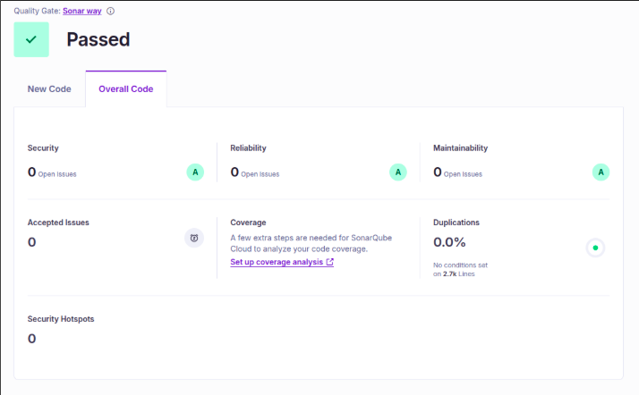
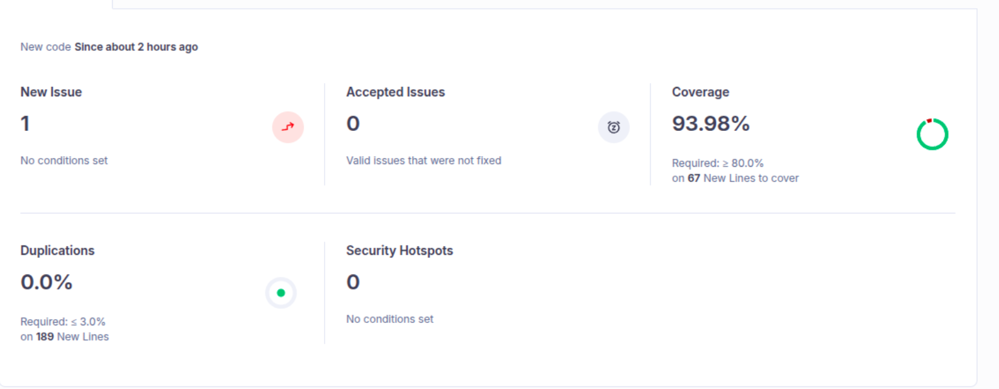

# Flight Booking System Microservices

## Overview
This project is a Flight Booking System built using Java and **Spring Boot Reactive WebFlux** following a microservices architecture.  
An existing monolithic application was split into independent services with separate databases, service discovery, centralized configuration, fault tolerance, and asynchronous communication.

## System Architecture

[View Summary Document](https://github.com/kanchanraiii/FlightBookingSystemMicroservice/blob/main/Summary%20Doc%20MicroServices%20Flight.pdf)

The diagram shows the API Gateway as a single entry point, independent core services with their own databases, service discovery using Eureka, centralized configuration, and asynchronous communication using Kafka.

---

## Microservices

- API Gateway - works on 9000 port
- Flight Service - works on 8090 port
- Booking Service - works on 8080
- Config Server - wokrs on 8761 port
  
### Flight Service
- Handles all flight related operations such as adding airlines, adding flights, and searching flights.  
- Implemented using Reactive WebFlux and MongoDB with database name `flight_db`.  
- Unit tested with JaCoCo coverage of 96 percent.

### Booking Service
- Manages booking operations including booking a flight, cancelling tickets, fetching booking details by email, and retrieving tickets using PNR.  
- Implemented using Reactive WebFlux and communicates with Flight Service using OpenFeign.  
- A Circuit Breaker is applied to handle service failures gracefully.  
- Uses MongoDB with database name `booking_db`.  
- Unit tested with JaCoCo coverage of 92 percent.

### Notification Service
Consumes Kafka events and sends booking confirmation emails.  
Email sending is asynchronous and decoupled from the booking flow.

---

## Supporting Components
- API Gateway used as a single entry point for all client requests
- Eureka Server for service discovery
- Config Server for centralized configuration management
- Apache Kafka as a message broker for email notifications
- Proper Validations, Exception Handling has been implemented in each service

---

## Testing and Code Quality

### Unit and Load Testing
- Unit testing completed for core services. Flight Service - 96 % and Booking Service - 92%
- Overall test coverage is 93.38 percent
- JMeter load testing performed using CLI with 20, 50, and 100 threads

### SonarQube Results
- Zero bugs
- Zero vulnerabilities
- Zero code duplications
- High maintainability rating

---

